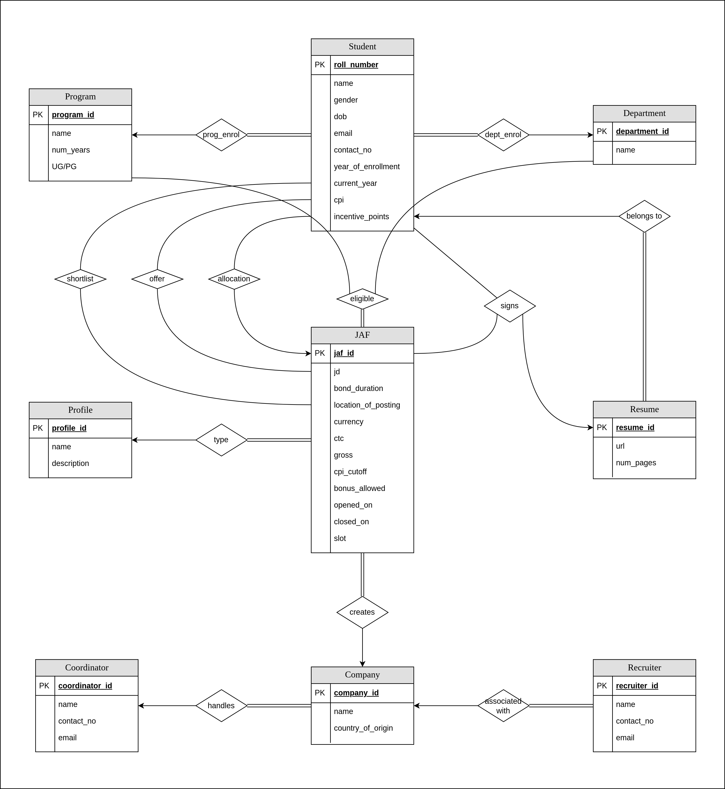
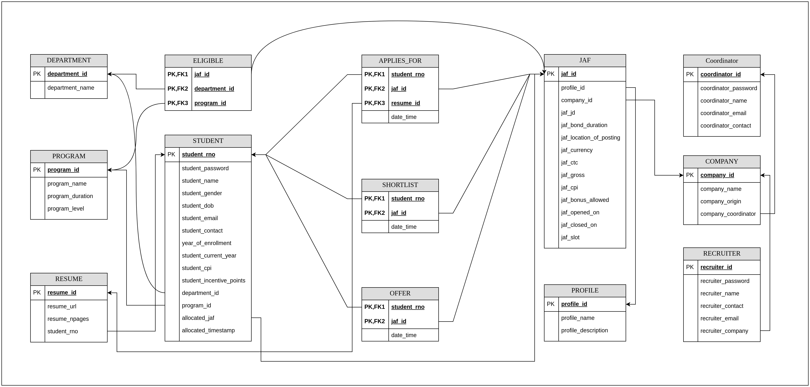

# Placement Portal

We plan to build a database information system (web application) that comprehensively
deals with the placement-related activities and logistics. The Placement Portal is a
one-stop platform for students, company recruiters and placement coordinators.
The system maintains the data of all the students along with their program, depart-
ment, CPI, etc. A recruiter can login on the portal, create job roles and define the
eligibility criterion for that role. Henceforth, the portal also stores the data of all the
firms interested in placements via the portal.

The recruiter opens the job roles (a.k.a. JAFs) for students to apply. Students will
see the JAFs on their interface that are currently open. Students can apply to the JAF
with one of their uploaded resumes if they meet the eligibility criterion for the JAF.
Once the JAF closes, the recruiter shortlists the students based on various parameters
including but not limited to CPI, resume, etc. Recruiters can conduct variable stages
of filtering the students (test, group discussion, etc) and therefore selectively moves
students to the next stages.

The portal allows the recruiter to add/remove the students for interviews. Once the
interviews are conducted, the recruiter releases the final offers. In case of multiple
offers, students are allocated one job based on their preference. Thereafter, they are
not allowed to apply for any further JAFs.

Furthermore, each recruiter will be appointed a coordinator to help him/her throughout
the process. Similarly, a coordinator will be assigned various firms. He/she can see the
firms allotted to him/her and associated features to manage the JAFs, shortlists and
selections.

There will be a Superuser (a.k.a Admin) who has access to information of all students,
firms and JAFs, and can edit them. This has to be backed up by secure authentication
mechanism.

3The portal will show various analytics such as department-wise/program-wise student
strength, profile-wise average CTC, top K popular JAFs, department-wise unplaced
students, etc selectively to various users as mentioned in the next section.
We plan to use a relational database for the application. Relational databases are an
obvious choice since there are a set of well defined entities and a set of well defined
relations between the entities. Also we want the data to follow a set of constraints
while being inserted/updated/retrieved from the database. Hence we use a relational
database (postgres).

## E-R Model

## Schema Diagram
